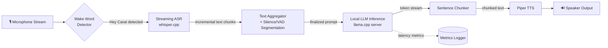

# Real-Time Edge Conversational AI System

<p align="center">
  <b>A fully offline, streaming, on-device voice assistant pipeline for resource-constrained edge hardware.</b>
</p>

<p align="center">
  
  
  
  
  
  <!-- Optional once CI is set up -->
  <!-- /<repo>/ci.yml"> -->
</p>

<p align="center">
  <i>Developed at the Department of Computer Science and Engineering, National Institute of Technology Rourkela,
  under the supervision of Prof. Anup Nandy.</i>
</p>

---

## Overview

CARAT is a fully **on-device conversational voice assistant** built to answer one question: *can a real-time,
privacy-preserving voice assistant run entirely on constrained edge hardware — no cloud, no internet — without
sacrificing usable responsiveness?*

It integrates three neural subsystems into a single low-latency, multi-threaded, streaming pipeline:

| Stage | Model | Engine |
|---|---|---|
| Wake Word Detection | Custom "Hey Carat" model | [openWakeWord](https://github.com/dscripka/openWakeWord) |
| Streaming Speech-to-Text (ASR) | Whisper (tiny.en / base.en / large-v3-turbo, quantized) | [whisper.cpp](https://github.com/ggerganov/whisper.cpp) |
| Local Language Model | Qwen2.5-0.5B-Instruct (Pi) / Gemma3-1B-Instruct (Jetson), Q4_K_M GGUF | [llama.cpp](https://github.com/ggerganov/llama.cpp) |
| Text-to-Speech (TTS) | Piper neural TTS (en/hi voices) | [Piper](https://github.com/rhasspy/piper) |

No component makes a network call outside `localhost`. The system was designed and evaluated for embedded,
robotics, and human-robot-interaction applications where cloud dependency is a liability, not a convenience.

> 📄 Full technical writeup: [`Real-Time Edge Conversational AI System` (Thesis, NIT Rourkela, 2026)](./main/docs/Thesis_final.pdf)

## Motivation

Cloud-hosted voice assistants (Alexa, Siri, Google Assistant) are accurate but come with three structural costs:
network-dependent latency, privacy exposure (raw audio leaving the device), and total unavailability without
connectivity. This project investigates whether the current generation of quantized, sub-1B-parameter LLMs and
optimized C/C++ ASR/TTS runtimes has closed the gap enough to make a **fully local** pipeline practical on
consumer-grade embedded boards — specifically a Raspberry Pi 4B (CPU-only) and an NVIDIA Jetson Orin Nano
(CUDA-accelerated).

## Architecture Overview




## Workflow (animated description)

1. **Idle listening** — the audio thread continuously reads mic frames; the wake-word model scores each frame.
2. **Wake** — once "Hey Carat" crosses its detection threshold, the ASR stream is unmuted.
3. **Streaming transcription** — whisper.cpp emits incremental text chunks every `--step` ms; a hallucination
   filter drops boilerplate ASR artifacts (`"thank you"`, `"[music]"`, etc.).
4. **Turn-end detection** — a silence timer (VAD-based) finalizes the buffered transcript into a prompt.
5. **LLM streaming** — the prompt is POSTed to a local `llama.cpp` HTTP server (`/v1/chat/completions`,
   `stream: true`); tokens arrive incrementally.
6. **Sentence-chunked TTS** — as tokens accumulate into complete sentences (regex-based chunking on
   `.`/`!`/`?`), each chunk is pushed to a dedicated TTS worker thread and spoken immediately — audio starts
   before the LLM has finished generating.
7. **Cooldown + re-arm** — after playback finishes, a short cooldown prevents the mic from re-triggering on the
   assistant's own voice, then the wake-word detector re-arms.
8. **Metrics** — ASR→LLM latency, Time-to-First-Token (TTFT), tokens/sec, and end-to-end latency are logged
   every turn.

## Features

- 🔌 **Fully offline** — zero cloud dependency at inference time.
- 🧵 **Multi-threaded streaming pipeline** — audio capture, ASR, LLM inference, and TTS all run concurrently.
- 🗣️ **Custom wake word** ("Hey Carat") trained via synthetic TTS-augmented data, ~92% validation accuracy.
- ✂️ **Chunked token→speech streaming** — perceived latency reduced by speaking sentences as they complete,
  not waiting for full generation.
- 🌐 **Bilingual support** (English / Hindi) in the wake-word variant, with per-language Piper voices.
- 📉 **4-bit quantized (Q4_K_M / GGUF) LLMs** for CPU-only inference on the Pi.
- 📊 **Built-in latency instrumentation** — ASR→LLM decision latency, TTFT, TPS, end-to-end latency logged per turn.
- 🧪 **Parameter sweep tooling** (`tune_whisper.py`) to auto-tune whisper.cpp streaming flags for a given board.
- 🧰 **Two deployment targets** — Raspberry Pi 4B (CPU-only) and NVIDIA Jetson Orin Nano (CUDA-accelerated).

## Hardware Support

| Device | RAM | CPU | GPU | Power | Status |
|---|---|---|---|---|---|
| **Raspberry Pi 4B** | 4 GB LPDDR4 | 4-core Arm® Cortex-A76 (64-bit) | VideoCore VII (unused) | 10–27 W | ✅ Primary target (CPU-only) |
| **NVIDIA Jetson Orin Nano** | 8 GB LPDDR5 | 6-core Arm® Cortex-A78AE (64-bit) | Ampere, 1024 CUDA cores | 7–25 W | ✅ Secondary target (GPU-accelerated LLM) |
| Other ARM64/x86_64 Linux SBCs | ≥ 4 GB | — | — | — | ⚠️ Untested — should work if `whisper.cpp`/`llama.cpp` build succeeds |

Peripheral: any USB/I²S microphone + speaker combo (`Logitech` webcam mic used in original testing).

## Software Stack

| Layer | Component | Notes |
|---|---|---|
| Wake word | openWakeWord (custom ONNX model) | Falls back: Porcupine (`wakeword.py`, legacy) |
| ASR | whisper.cpp (`whisper-stream` / `whisper-stream-pcm`) | GGML/GGUF Whisper models, CPU-only on Pi |
| LLM serving | llama.cpp `llama-server` (OpenAI-compatible `/v1/chat/completions`) | GGUF, Q4_K_M quantization |
| TTS | Piper (`rhasspy/piper`) | ONNX voices, raw PCM piped to `aplay`/`paplay` |
| Orchestration | Python 3.9+ (`threading`, `queue`, `requests`) | No async framework — thread + queue based |
| Audio I/O | PyAudio / ALSA / PulseAudio | ALSA error suppression via `ctypes` hook |

## Installation (Quickstart)

```bash
git clone https://github.com/<org>/carat-voice-assistant.git
cd carat-voice-assistant

# 1. System dependencies (see INSTALL.md for full per-platform steps)
sudo apt update && sudo apt install -y build-essential cmake portaudio19-dev \
    libasound2-dev alsa-utils pulseaudio git

# 2. Python environment
python3 -m venv .venv && source .venv/bin/activate
pip install -r requirements.txt

# 3. Build whisper.cpp and llama.cpp (see INSTALL.md)
# 4. Download models (see MODELS.md)

# 5. Start the local LLM server
./llama.cpp/build/bin/llama-server -m models/qwen2.5-0.5b-instruct-q4_k_m.gguf \
    --port 8080 -c 2048

# 6. Run the assistant
python carat_assistant_wake.py --language en
```

Full step-by-step instructions (Pi / Jetson / Ubuntu, CUDA setup, model downloads, troubleshooting) are in
[`INSTALL.md`](INSTALL.md).

## Usage Examples

```bash
# English, default wake-word pipeline
python carat_assistant_wake.py

# Hindi
python carat_assistant_wake.py --language hi

# Jetson deployment variant (no wake word, always-listening + silence VAD)
python jetson_dep.py

# Sweep whisper.cpp streaming parameters to find the best config for your board
python tune_whisper.py --auto
```

## Screenshots / Demo
Sample deployment on Jetson Orin Nano Device:
[Demo](https://drive.google.com/file/d/1YrM1zGAlnXKuyhSDw6pzLB2aT2vs32Ob/view?usp=sharing)
